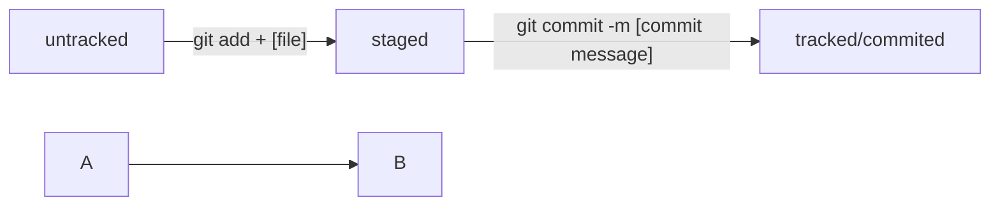

# Проект по изучению возможностей GIT от Яндекс.Практикум

[Яндекс.Практикум](https://practicum.yandex.ru) — платформа для образования.

---
## Команды GIT  

```git add .``` — добавляет текущую папку со всем ее содержимым в список файлов для отслеживания   
```git commit -m "commit message"``` — фиксирует состояние репозитория на текущий момент времени. Сопровождает коммит сообщением "commit message"  

---
## Команды CLI

```rmdir``` — удалить папку (без файлов)  
 
```rm -r``` — удалить папку рекурсивно (с файлами)  

---

## Схемы статусов файлов  


